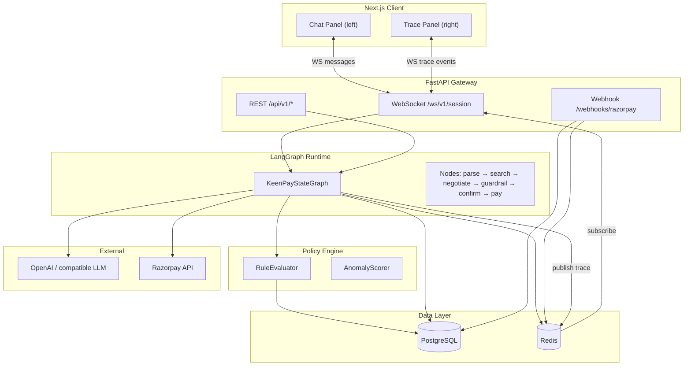
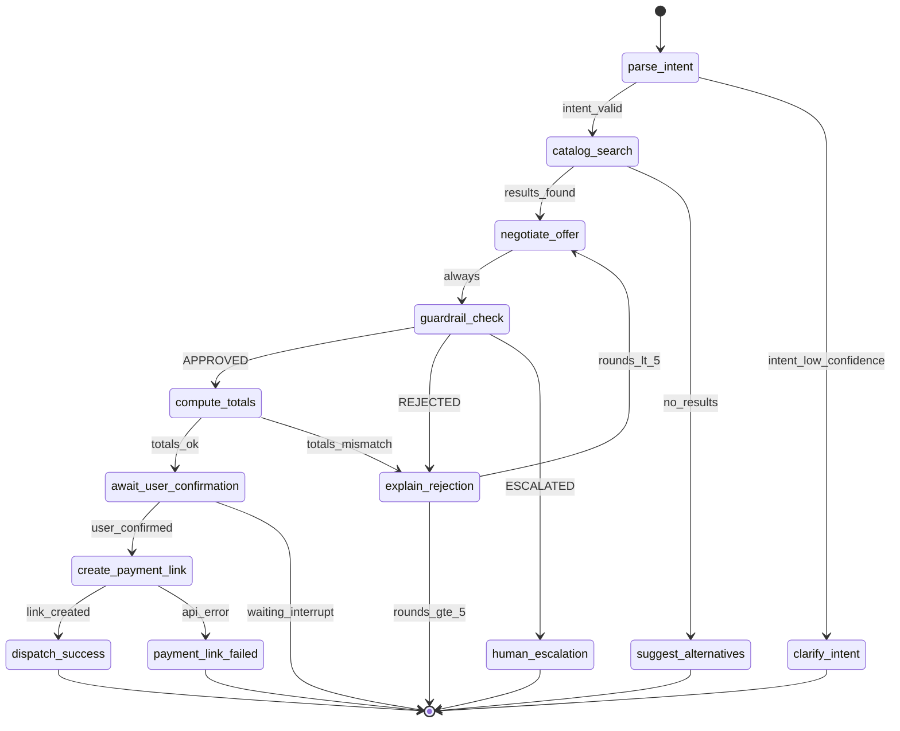
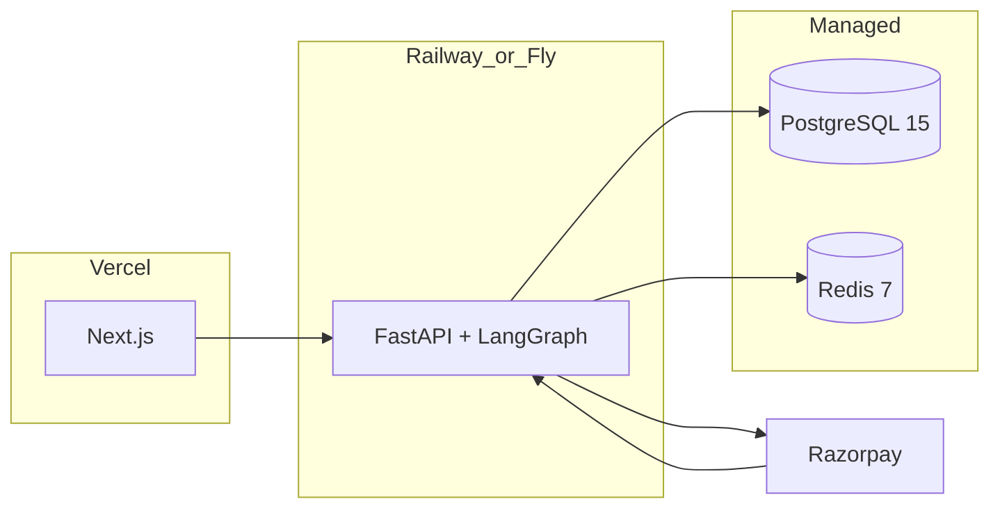

# KeenPay — System Architecture

**Version:** 1.0.0  
**Stack:** FastAPI · LangGraph · Pydantic · PostgreSQL · Redis · Next.js/React · Razorpay

---

## 1. Architecture Overview

KeenPay follows a **control-plane / data-plane split**:

- **Control plane (LangGraph):** Orchestrates conversation turns, tool calls, and state transitions.
- **Policy plane (Deterministic):** Python rules engine—no LLM involvement in approve/deny.
- **Data plane:** PostgreSQL (source of truth), Redis (cache, holds, rate limits, pub/sub).
- **Presentation plane:** Next.js split UI with WebSocket subscriptions.



---

## 2. Component Responsibilities

| Component | Responsibility | Technology |
|-----------|----------------|------------|
| `frontend/` | Split UI, WebSocket client, trace visualization | Next.js 14, React 18, Tailwind |
| `api/main.py` | HTTP + WS entry, auth, CORS | FastAPI 0.111+ |
| `api/graph/keen_checkout.py` | LangGraph definition, checkpointing | LangGraph 0.2+ |
| `api/policy/engine.py` | Deterministic guardrails | Pure Python + Pydantic |
| `api/services/catalog.py` | Product search, stock reads | SQLAlchemy async |
| `api/services/razorpay.py` | Payment Links, webhook verify | `httpx`, HMAC |
| `api/services/audit.py` | Append-only audit pipeline | PostgreSQL |
| `api/services/trace.py` | Trace event serialization + Redis pub/sub | Redis |
| `workers/webhook_processor.py` | Async webhook idempotent processing | FastAPI background / Celery optional |

---

## 3. End-to-End Data Flow

### 3.1 Inbound Chat Message

```
1. Client sends WS: { type: "chat.message", payload: { text, session_id } }
2. FastAPI validates JWT / session token
3. Load checkpoint from PostgreSQL (langgraph_checkpoints table) or create session
4. graph.ainvoke({ messages: [HumanMessage(text)] }, config={ thread_id: session_id })
5. Each node emits TraceEvent → Redis PUBLISH trace:{session_id}
6. WS handler forwards TraceEvent to client
7. Final AIMessage + structured CartOffer returned in chat.response
8. State persisted: negotiation_sessions + audit_logs
```

### 3.2 Guardrail Gate (Critical Path)

```
negotiate_offer node
  → writes proposed_offer to state (NOT final)
  → edge to guardrail_check node
guardrail_check node
  → PolicyEngine.evaluate(ProposedOffer, MerchantPolicy, InventorySnapshot)
  → writes guardrail_decision, guardrail_decision_id, approved_offer | rejection_reasons
  → conditional edge:
       APPROVED → compute_totals → await_user_confirmation
       REJECTED → explain_rejection → END (or negotiate if rounds < 5)
       ESCALATED → human_review_queue
```

### 3.3 Payment Link Creation

```
await_user_confirmation (interrupt)
  → user sends chat.confirm_payment
  → create_payment_link node
       → verify all gates (see PRD)
       → reserve inventory (Redis + DB transaction)
       → POST Razorpay /v1/payment_links
       → insert orders row status=pending
       → audit_logs: PAYMENT_LINK_CREATED
```

### 3.4 Webhook Finalization

```
POST /webhooks/razorpay
  → verify X-Razorpay-Signature
  → idempotency: webhook_events.event_id UNIQUE
  → match order by payment_link_id
  → verify amount_paise == order.final_amount_paise
  → UPDATE orders SET status='paid'
  → audit_logs: PAYMENT_CAPTURED
  → Redis PUBLISH order:{session_id} → WS order.status_updated
```

---

## 4. LangGraph State Graph

### 4.1 State Schema (`KeenPayState`)

Defined in `api/graph/state.py` as a `TypedDict` with reducers:

```python
from typing import Annotated, Literal, Optional
from typing_extensions import TypedDict
from langgraph.graph.message import add_messages
from pydantic import BaseModel


class LineItem(BaseModel):
    sku: str
    product_id: str
    name: str
    quantity: int
    list_unit_price_paise: int
    negotiated_unit_price_paise: Optional[int] = None


class ProposedOffer(BaseModel):
    version: int
    line_items: list[LineItem]
    discount_pct: float
    discount_amount_paise: int
    subtotal_paise: int
    final_amount_paise: int
    currency: Literal["INR"] = "INR"
    rationale: str  # agent explanation for user; not used by policy engine


class GuardrailDecision(BaseModel):
    decision_id: str  # UUID v4
    outcome: Literal["APPROVED", "REJECTED", "ESCALATED"]
    rule_results: list[dict]  # serialized RuleResult[]
    evaluated_at: str  # ISO8601 UTC
    policy_version: str


class KeenPayState(TypedDict):
    # Conversation
    messages: Annotated[list, add_messages]

    # Session identity
    session_id: str
    user_id: Optional[str]
    merchant_id: str

    # Intent & catalog
    parsed_intent: Optional[dict]
    search_results: list[dict]
    selected_line_items: list[LineItem]

    # Negotiation
    proposed_offer: Optional[ProposedOffer]
    approved_offer: Optional[ProposedOffer]
    negotiation_round: int  # 0-indexed, max 4

    # Guardrails
    guardrail_decision: Optional[Literal["APPROVED", "REJECTED", "ESCALATED"]]
    guardrail_decision_id: Optional[str]
    guardrail_detail: Optional[GuardrailDecision]
    rejection_reasons: list[str]

    # User gates
    user_confirmed_payment: bool
    user_confirmed_at: Optional[str]

    # Totals (deterministic, post-approval)
    final_amount_paise: Optional[int]
    inventory_reserved: bool

    # Payment
    razorpay_payment_link_id: Optional[str]
    razorpay_payment_link_url: Optional[str]
    order_id: Optional[str]

    # Security & anomaly
    anomaly_flags: list[str]
    security_block: bool

    # Control
    next_node_hint: Optional[str]
    error: Optional[dict]
```

### 4.2 Graph Topology



### 4.3 Node Responsibilities

| Node | Input | Output / Side Effects |
|------|-------|----------------------|
| `parse_intent` | Latest user message | `parsed_intent`: `{ product_query, qty, attributes, budget_paise, confidence }` |
| `clarify_intent` | Low confidence intent | AIMessage asking clarifying question |
| `catalog_search` | `parsed_intent` | `search_results`, `selected_line_items` (top match) |
| `suggest_alternatives` | Empty search | AIMessage with alternatives |
| `negotiate_offer` | line items + history | `proposed_offer`, increments `negotiation_round` |
| `guardrail_check` | `proposed_offer` | Calls `PolicyEngine`; sets decision fields |
| `explain_rejection` | `rejection_reasons` | AIMessage with policy-cited explanation |
| `compute_totals` | `approved_offer` | Deterministic `final_amount_paise` |
| `await_user_confirmation` | approved totals | **Interrupt**; sets `user_confirmed_payment` on resume |
| `create_payment_link` | gated state | Razorpay API, `order_id`, inventory hold |
| `dispatch_success` | link URL | AIMessage with pay button |
| `payment_link_failed` | error | AIMessage + retry guidance |
| `human_escalation` | ESCALATED | Queue row + user notice |

### 4.4 Conditional Edge Functions

```python
# api/graph/edges.py

def after_parse_intent(state: KeenPayState) -> str:
    intent = state.get("parsed_intent") or {}
    if state.get("security_block"):
        return "blocked"
    if intent.get("confidence", 0) < 0.6:
        return "clarify"
    return "search"


def after_catalog_search(state: KeenPayState) -> str:
    if not state.get("search_results"):
        return "no_results"
    return "found"


def after_guardrail(state: KeenPayState) -> str:
    decision = state.get("guardrail_decision")
    if decision == "APPROVED":
        return "approved"
    if decision == "ESCALATED":
        return "escalated"
    return "rejected"


def after_rejection(state: KeenPayState) -> str:
    if state.get("negotiation_round", 0) >= 5:
        return "max_rounds"
    return "retry_negotiate"


def after_confirmation(state: KeenPayState) -> str:
    if state.get("user_confirmed_payment"):
        return "confirmed"
    return "wait"  # should not traverse; interrupt pauses graph


def after_payment_link(state: KeenPayState) -> str:
    if state.get("razorpay_payment_link_url"):
        return "success"
    return "failed"
```

### 4.5 Checkpointing & Interrupts

- **Checkpointer:** `AsyncPostgresSaver` (LangGraph) on table `langgraph_checkpoints`.
- **Thread ID:** `negotiation_sessions.id` (UUID).
- **Interrupt before:** `await_user_confirmation` — graph pauses until `Command(resume={"user_confirmed_payment": True})`.
- **Offer versioning:** Each `negotiate_offer` increments `proposed_offer.version`; guardrail decisions bind to `(session_id, offer_version)`.

---

## 5. Policy Engine Integration

```
guardrail_check node
    │
    ├─► InventoryService.get_snapshot(skus)
    ├─► MerchantPolicy.load(merchant_id)  # from DB or config
    ├─► AnomalyScorer.score(state)        # prompt injection, margin probe
    └─► PolicyEngine.evaluate(offer, policy, inventory, anomaly)
            │
            └─► AuditService.log_guardrail(decision)
```

Policy engine is **synchronous and deterministic** (no `async` LLM calls inside).

---

## 6. Traceability & Audit Logging Pipeline

### 6.1 Trace Events (Real-Time UI)

**Channel:** Redis `PUBLISH trace:{session_id}`  
**Consumer:** FastAPI WebSocket task per connection

```python
class TraceEvent(BaseModel):
    event_id: str
    session_id: str
    timestamp: str  # ISO8601 UTC
    event_type: Literal[
        "graph.node.enter",
        "graph.node.exit",
        "guardrail.rule.eval",
        "guardrail.decision",
        "security.flag",
        "payment.link.created",
        "payment.webhook.received",
        "error",
    ]
    node_name: Optional[str]
    payload: dict
    duration_ms: Optional[int]
    parent_event_id: Optional[str]
```

**Emission points:**

| Location | event_type |
|----------|------------|
| LangGraph wrapper (pre/post node) | `graph.node.enter` / `graph.node.exit` |
| `PolicyEngine.evaluate` per rule | `guardrail.rule.eval` |
| After full evaluation | `guardrail.decision` |
| `AnomalyScorer` | `security.flag` |
| `create_payment_link` | `payment.link.created` |
| Webhook handler | `payment.webhook.received` |

### 6.2 Audit Logs (Durable)

**Table:** `audit_logs` (see `SCHEMA.sql`)

Every state transition with financial impact writes an audit row:

```python
class AuditRecord(BaseModel):
    id: str
    session_id: str
    order_id: Optional[str]
    actor: Literal["agent", "policy_engine", "user", "system", "webhook"]
    action: str  # e.g. GUARDRAIL_EVALUATED, PAYMENT_LINK_CREATED
    decision_id: Optional[str]
    offer_version: Optional[int]
    input_snapshot: dict   # JSONB — proposed offer, policy version
    output_snapshot: dict  # JSONB — decision, rule results
    idempotency_key: Optional[str]
    created_at: datetime
```

**Pipeline:**

```
Node/Service action
  → AuditService.append(record)  [PostgreSQL INSERT]
  → TraceService.emit(event)     [Redis PUBLISH → WS]
```

Audit writes are **append-only**; no UPDATE/DELETE in application code.

### 6.3 Correlation IDs

| ID | Scope |
|----|-------|
| `session_id` | Full negotiation lifecycle |
| `decision_id` | Single guardrail evaluation |
| `event_id` | Single trace event |
| `order_id` | Order + payment lifecycle |
| `razorpay_payment_link_id` | Razorpay entity |

All money actions log `session_id` + `decision_id` + `offer_version`.

---

## 7. Redis Key Design

| Key Pattern | TTL | Purpose |
|-------------|-----|---------|
| `session:{id}:messages` | 24h | Hot message cache |
| `hold:{session_id}:{sku}` | 15m | Inventory soft hold qty |
| `ratelimit:payment_link:{session_id}` | 1h | Max 3 link creations/hour |
| `ratelimit:chat:{user_id}` | 1m | 30 messages/min |
| `trace:{session_id}` | — | Pub/sub channel (no key) |
| `idempotency:rz:link:{session_id}:v{version}` | 24h | Cached link response |

---

## 8. Deployment Topology



**Environment variables:**

| Variable | Purpose |
|----------|---------|
| `DATABASE_URL` | PostgreSQL async |
| `REDIS_URL` | Cache, pub/sub, holds |
| `RAZORPAY_KEY_ID` / `RAZORPAY_KEY_SECRET` | API auth |
| `RAZORPAY_WEBHOOK_SECRET` | Signature verify |
| `OPENAI_API_KEY` | LLM |
| `MERCHANT_POLICY_JSON` | Default policy overrides |

---

## 9. Security Architecture

- **LLM boundary:** LLM outputs parsed into `ProposedOffer`; never trusted for amounts without guardrail.
- **Webhook:** HMAC-SHA256 on raw body; reject timestamp &gt; 5 min skew.
- **WS auth:** Short-lived JWT in query `?token=` validated on connect.
- **PII:** User email/phone only in Razorpay link `customer` object; not logged in trace payload.

---

## 10. Failure Modes Summary

| Failure | Detection | Response |
|---------|-----------|----------|
| LLM timeout | 10s asyncio timeout | `error` node; no offer change |
| DB unavailable | Connection error | 503 REST; WS `error` event |
| Guardrail exception | try/except in node | `ESCALATED` + audit |
| Razorpay 5xx | HTTP status | Retry 3x exponential; user message |
| Duplicate webhook | UNIQUE `event_id` | 200 OK idempotent |

See `GUARDRAILS_AND_SAFETY.md` for the full failure matrix and risk register.

---

## 11. AI Responsibility Boundary

KeenPay enforces a strict split between language intelligence and financial logic. The LLM participates only in `parse_intent` and `negotiate_offer` (proposal + copy). All math, inventory checks, policy evaluation, and Razorpay calls run in deterministic Python.

| Concern | Owner | Document |
|---------|-------|----------|
| When to use LLM vs. code | Architecture team | `AI_JUDGMENT.md` |
| Policy rules and gates | Security / backend | `GUARDRAILS_AND_SAFETY.md` |
| Trace visibility | Frontend + backend | §6 above |

**Prohibited:** Exposing `create_payment_link` as an LLM tool. **Required:** `assert_payment_gates()` before every Razorpay API call.
