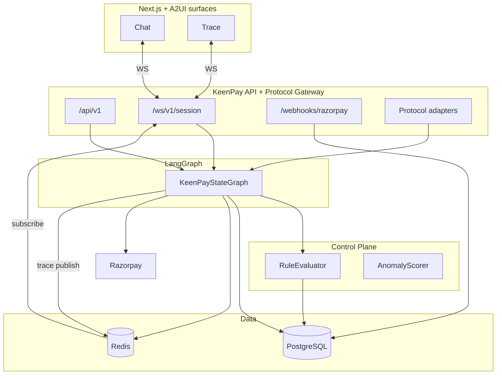
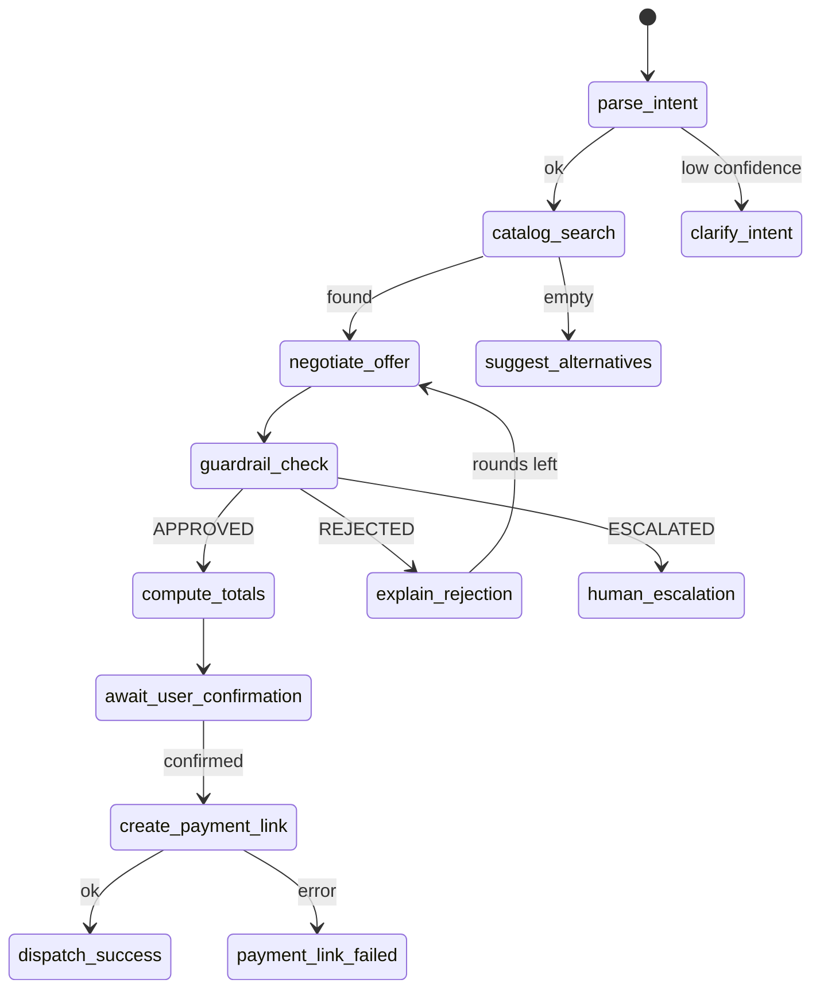

# KeenPay — architecture

FastAPI + LangGraph + PostgreSQL + Redis + Next.js + Razorpay.

Canonical architecture reference. Merges the production workflow spec, agentic-commerce V4 design (protocol gateway), and implementation build map.

> Different protocols can enter KeenPay, but none can bypass the KeenPay Control Plane.

## Engineering philosophy

AI models are non-deterministic. They are good at language, negotiation, and routing. They are **not** trusted to move money. KeenPay keeps a strict air-gap: agents and external protocols may propose commerce actions, but only the deterministic Control Plane may authorize and execute payment.

V4 adds a **Protocol Gateway** so UCP, ACP, AP2, A2A, MCP, x402, A2UI, and India rails (NPCI UAP / UPI) can enter through adapters — not through separate payment stacks. Every adapter normalizes to one **KeenPay Intent**. One policy engine. One audit trail.

### Grow / Sell / Protect

| Phase | Layer | Responsibility |
|-------|-------|----------------|
| **Grow** | AI / LangGraph | Intent parsing, catalog search, upsell & negotiation |
| **Sell** | Cart assembly | Cart assembler, price calculator (integer paise), checkout intent emitter |
| **Protect** | Control Plane | Policy + risk checks, authorization gate, payment execution |

### Trust boundaries

| Level | What |
|-------|------|
| **Untrusted** | Protocol payloads, user input, LLM output, inbound webhooks (validated on receipt) |
| **Semi-trusted** | LangGraph orchestration + protocol adapters (propose actions, never pay) |
| **Trusted** | Control Plane, integer math, scoped authorization, Razorpay client (gated side effects) |

## Planes

| Plane | Role |
|-------|------|
| Presentation | Next.js — chat panel + trace panel, WebSocket client |
| API gateway | FastAPI — REST, WS, protocol ingress, Razorpay webhook |
| Orchestration | LangGraph — `KeenPayStateGraph`, checkpoints in Postgres |
| Policy | Sync Python — `PolicyEngine`, no LLM in approve path |
| Data | Postgres source of truth; Redis cache, holds, rate limits, trace pub/sub |



## Protocol Gateway (V4)

The Protocol Gateway is the single front door for agentic-commerce protocols. It authenticates the caller, validates schema, maps protocol-specific messages to a **Normalized KeenPay Intent**, and forwards that intent to the Control Plane. No adapter calls Razorpay, UPI, or x402 directly.

```
Protocol ingress (UCP | ACP | AP2 | A2A | MCP | x402 | A2UI | NPCI UAP / UPI)
  -> Protocol Gateway (AuthN, agent identity, schema validation, replay / idempotency keys)
  -> Protocol Adapters (thin translators -> Normalized KeenPay Intent)
  -> Control Plane (Policy Engine -> Risk Scorer -> Authorization -> Inventory lock)
  -> Payment rail router (Razorpay core; UPI / x402 stubs)
  -> Settlement + audit (webhooks, reconciliation, Transaction Passport, audit_logs)
```

### Protocol catalog

| Protocol | Role | Status | KeenPay mapping |
|----------|------|--------|-----------------|
| MCP | Controlled agent tools & context | Core | Tool allowlist on agents; MCP server maps to approved tools only |
| ACP | Agentic checkout / commerce | Core | Same as SELL path: cart -> guardrail -> pay |
| A2UI | Agent-driven UI components | Adapter-ready | Split UI: chat + trace; A2UI renders into hosted surfaces |
| UCP | Commerce interoperability | Adapter-ready | Adapter normalizes catalog/cart to KeenPay Intent |
| AP2 | Payment mandates & verifiable auth | Adapter-ready | Maps to authorizations (scoped, expiring, single-use) |
| A2A | Agent-to-agent messaging | Experimental | Gateway accepts A2A envelope; no production adapter yet |
| x402 | Machine / pay-per-use HTTP payments | Experimental | Rail router stub; does not bypass Control Plane |
| NPCI UAP | India unified agentic payments | Future | Architecture slot in rail router; no live integration |
| UPI | India instant payments | Future | Settlement rail behind same authorization object |

**What we do not do:** separate payment systems per protocol; LLM-direct Razorpay / UPI / x402 calls; protocol-specific policy engines; claiming live UPI/x402 until adapter + rail tests pass.

## Intended modules

| Path | Responsibility |
|------|----------------|
| `frontend/` | Split UI, trace renderer |
| `api/main.py` | App entry, CORS, auth |
| `api/graph/keen_checkout.py` | Graph definition |
| `api/graph/state.py` | `KeenPayState` |
| `api/graph/edges.py` | Conditional routing |
| `api/policy/engine.py` | Guardrails |
| `api/policy/anomaly.py` | Injection + score |
| `api/services/catalog.py` | Product search |
| `api/services/razorpay.py` | Links + webhook verify |
| `api/services/audit.py` | `audit_logs` writes |
| `api/services/trace.py` | Redis pub/sub |
| `workers/webhook_processor.py` | Async idempotent webhook handling |

## Workflows: Grow, Sell, Protect

Lifecycle stays linear. Protocol origin does not shorten the path.

```
Protocol -> Gateway -> Intent -> GROW/SELL -> PROTECT -> [APPROVED] -> Pay -> Settle
```

### Phase 1 — Grow (discovery & revenue optimization)

1. **Intent** — Buyer or external agent requests a product, bundle, or discount.
2. **Catalog** — Postgres full-text search — not LLM hallucination.
3. **Upsell** — Agent proposes bundle or discount percentage (not final price).
4. **Intent emit** — Adapter or LangGraph emits Normalized KeenPay Intent.

### Phase 2 — Protect (guardrail interception)

1. **Inventory lock** — Redis + Postgres hold; fail closed if stock unavailable.
2. **Policy** — Max discount, margin floor, qty caps — Python only.
3. **Price re-computation** — Final total calculated in integer paise by backend, not the LLM.
4. **Risk** — Injection patterns, velocity, anomaly score.
5. **Authorization** — Scoped permission bound to cart hash + amount; single-use.

### Phase 3 — Sell (Razorpay execution & settlement)

1. **User confirm** — Explicit confirm via LangGraph interrupt; not inferred from chat.
2. **Idempotent order** — Idempotency key per offer version; cart hash bound.
3. **Payment link** — Razorpay `POST /v1/payment_links` (test or live).
4. **Webhook** — HMAC verify, dedupe `event_id`, amount match, mark paid.
5. **Passport** — `audit_logs` + order snapshot for replay.

## Request path: chat message

```
1. WS { type: "chat.message", text, session_id }
2. Validate JWT
3. Load/create checkpoint (langgraph_checkpoints / negotiation_sessions)
4. graph.ainvoke(..., config={ thread_id: session_id })
5. Each node -> TraceEvent -> Redis PUBLISH trace:{session_id}
6. WS forwards trace to client
7. chat.response with assistant message + structured offer if any
8. Persist negotiation_sessions + audit_logs on financial steps
```

## Guardrail path (critical)

```
negotiate_offer -> proposed_offer (not trusted)
guardrail_check -> PolicyEngine.evaluate(...)
  -> guardrail_decision, guardrail_decision_id, approved_offer | rejection_reasons
  APPROVED  -> compute_totals -> await_user_confirmation
  REJECTED  -> explain_rejection -> negotiate if rounds < 5
  ESCALATED -> human_escalation -> escalation_tickets
```

Policy evaluation is synchronous. No LLM calls inside `guardrail_check`.

## Payment path

```
await_user_confirmation (interrupt)
  user sends chat.confirm_payment
  create_payment_link:
    assert_payment_gates()
    reserve stock (Redis + PG transaction, inventory_holds)
    POST Razorpay /v1/payment_links (idempotency key)
    INSERT orders (pending)
    audit_logs PAYMENT_LINK_CREATED
```

## Payment state machine

Same state machine for all rails. `UNKNOWN` is a real state — never blind retry.

| State | Next | Notes |
|-------|------|-------|
| `created` | `payment_pending` | Order + authorization issued |
| `payment_pending` | `captured` | Webhook or poll confirms pay |
| `captured` | `completed` | Reconciliation OK |
| `payment_pending` | `unknown` | Timeout / no webhook |
| `unknown` | `reconciliation` | Ask provider truth |
| `unknown` | `captured` / `failed` | After reconcile |
| `authorization` | `approved` -> `consumed` | Single-use scope |
| `authorization` | `expired` / `revoked` | No pay allowed |

Webhook + reconciliation (all rails):

- Verify signature (HMAC for Razorpay)
- Dedupe by `provider_event_id`
- Amount must match `authorized amount_minor`
- Mismatch -> `payment_disputed`, HITL P0, no auto-complete
- Outbox worker publishes events; reconciliation worker resolves `UNKNOWN`

## Webhook path

```
POST /webhooks/razorpay
  verify X-Razorpay-Signature
  INSERT webhook_events (event_id UNIQUE) — duplicate -> 200 no-op
  match order by payment_link_id
  if amount != order.final_amount_paise -> payment_disputed
  else orders.status = paid, audit_logs PAYMENT_CAPTURED
  WS order.status_updated
```

## State shape (`KeenPayState`)

Defined in `api/graph/state.py`:

```python
class KeenPayState(TypedDict):
    messages: Annotated[list, add_messages]
    session_id: str
    user_id: Optional[str]
    merchant_id: str
    parsed_intent: Optional[dict]
    search_results: list[dict]
    selected_line_items: list[LineItem]
    proposed_offer: Optional[ProposedOffer]
    approved_offer: Optional[ProposedOffer]
    negotiation_round: int  # max 4 (0-indexed) -> 5 rounds
    guardrail_decision: Optional[Literal["APPROVED", "REJECTED", "ESCALATED"]]
    guardrail_decision_id: Optional[str]
    guardrail_detail: Optional[GuardrailDecision]
    rejection_reasons: list[str]
    user_confirmed_payment: bool
    user_confirmed_at: Optional[str]
    final_amount_paise: Optional[int]
    inventory_reserved: bool
    razorpay_payment_link_id: Optional[str]
    razorpay_payment_link_url: Optional[str]
    order_id: Optional[str]
    anomaly_flags: list[str]
    security_block: bool
    error: Optional[dict]
```

`ProposedOffer` / `GuardrailDecision` models are in the same module (see `api/graph/state.py`).

## Graph topology



## Edge helpers (`api/graph/edges.py`)

```python
def after_guardrail(state: KeenPayState) -> str:
    d = state.get("guardrail_decision")
    if d == "APPROVED":
        return "approved"
    if d == "ESCALATED":
        return "escalated"
    return "rejected"

def after_rejection(state: KeenPayState) -> str:
    if state.get("negotiation_round", 0) >= 5:
        return "max_rounds"
    return "retry_negotiate"
```

## Checkpointing

- Checkpointer: `AsyncPostgresSaver` on `langgraph_checkpoints`
- `thread_id` = `negotiation_sessions.id`
- Interrupt before `await_user_confirmation`
- Resume: `Command(resume={"user_confirmed_payment": True})`
- Guardrail decisions bind to `(session_id, offer_version)`

## Security matrix

No protocol or LLM prompt overrides these. Enforced in Control Plane code.

| Vector | Threat | KeenPay response |
|--------|--------|------------------|
| Cross-tenant leak | Protocol sends wrong tenant | RLS + server-set tenant context |
| Double spend | Retry after timeout | Idempotency + never-retry-unknown |
| Margin erosion | Injection / fake discount | `RULE_MIN_MARGIN` + price floor |
| Oversell | Two agents, one SKU | Redis lock + `FOR UPDATE` holds |
| Untraceable pay | Dispute with no proof | Transaction Passport from `audit_logs` |
| Forged webhook | Fake paid event | HMAC + event dedupe + amount check |
| LLM math | Wrong total | Integer paise in `compute_totals` only |
| Protocol bypass | Adapter calls Razorpay | Adapters cannot hold payment credentials |
| Prompt injection | Bypass rules via chat | Deterministic regex + anomaly scorer; `security_block` halts money actions |
| Data isolation | Cross-merchant data leaks | Row-Level Security in PostgreSQL |
| Concurrency | Two agents sell last item | Redis distributed locks + `inventory_holds` |

### Authorization outcomes

| Outcome | When |
|---------|------|
| **AUTO-APPROVE** | Low risk: discount within policy, stock available, anomaly score < 0.5 |
| **CLAMP** | Discount exceeds cap: force to `merchant.max_discount_limit` |
| **REJECT** | Margin violation or invalid SKU: halt, explain to user |
| **STEP-UP / HUMAN** | High risk or max negotiation rounds: escalation ticket to merchant |

### Protocol Gateway security

Every protocol adapter runs the same security checks before the Control Plane sees data:

| Control | Gateway enforcement |
|---------|---------------------|
| Authentication | mTLS or signed JWT per protocol; no anonymous money ingress |
| Agent identity | `agents` table: type, scopes, `allowed_tools`, trust_level, expiry |
| Schema validation | Pydantic / JSON Schema per adapter; reject malformed payloads |
| Replay protection | nonce + timestamp window; `idempotency_keys` per scope |
| Scoped authorization | AP2 mandates map to authorizations; bound to `cart_hash` + amount |
| Idempotency | Same key returns same result; no double spend |
| Tool allowlisting | MCP tools must appear in `agents.allowed_tools` JSONB |
| Tenant isolation | `tenant_id` on every row; Postgres RLS; `SET LOCAL` per request |

## Transaction Passport & audit

No separate passport table. Built from `negotiation_sessions`, `orders`, `audit_logs`, and `webhook_events` for support replay and compliance.

| Field | Source |
|-------|--------|
| `protocol_ref` | Which adapter / protocol originated the intent |
| `session_id` | Agent session or LangGraph thread |
| `authorization_id` | Scoped approval used for payment |
| `decision_id` | Guardrail evaluation reference |
| `offer_version` | Monotonic cart proposal version |
| `policy_version` | Ruleset that ran (e.g. `2026.08.1`) |
| `grow_trace` | Intent, catalog hits, negotiation rationale |
| `protect_trace` | Per-rule pass/fail/clamp results |
| `sell_trace` | Rail, `idempotency_key`, webhook ids |
| `final_amount_paise` | Deterministic integer total |

**Live (Redis):** `PUBLISH trace:{session_id}`

```python
class TraceEvent(BaseModel):
    event_id: str
    session_id: str
    timestamp: str
    event_type: Literal[
        "graph.node.enter", "graph.node.exit",
        "guardrail.rule.eval", "guardrail.decision",
        "security.flag", "payment.link.created",
        "payment.webhook.received", "error",
    ]
    node_name: Optional[str]
    payload: dict
    duration_ms: Optional[int]
```

**Durable (Postgres):** `audit_logs` — append only, trigger blocks UPDATE/DELETE.

Every money step logs `session_id`, `decision_id`, `offer_version` where applicable.

## Redis keys

| Key | TTL | Use |
|-----|-----|-----|
| `session:{id}:messages` | 24h | hot cache |
| `hold:{session_id}:{sku}` | 15m | soft hold |
| `ratelimit:payment_link:{session_id}` | 1h | max 3 links/hour |
| `ratelimit:chat:{user_id}` | 1m | 30 msg/min |
| `idempotency:rz:link:{session_id}:v{n}` | 24h | cached link response |

## Deploy

### Pilot (current)

```
Vercel / static host  -> Next.js
Railway / Fly         -> FastAPI + LangGraph
Managed               -> Postgres 15, Redis 7
External              -> Razorpay, LLM provider
```

Env: `DATABASE_URL`, `REDIS_URL`, `RAZORPAY_*`, `OPENAI_API_KEY`, `MERCHANT_POLICY_JSON`.

### AWS (production target)

Monolithic API first. Workers for webhooks and reconciliation. No per-protocol stacks.

| Layer | AWS service | Purpose |
|-------|-------------|---------|
| Edge | ALB + WAF | TLS termination, rate limits |
| Compute | ECS Fargate / EKS | FastAPI + LangGraph + Protocol Gateway |
| Data | RDS PostgreSQL | RLS catalog, orders, `audit_logs` |
| Cache | ElastiCache Redis | Locks, sessions, trace pub/sub |
| Secrets | Secrets Manager | Razorpay keys — never in DB or LLM |
| Async | SQS + workers | `webhook_events`, outbox, reconciliation |
| Static | S3 + CloudFront | A2UI assets, exports |
| Logs | CloudWatch | Structured audit `correlation_id` |

### Human-in-the-loop

- `escalation_tickets` for ESCALATED guardrail outcomes
- Human override logged with `actor=human`; margin floor not overridden in v1
- Payment disputed (webhook mismatch) -> P0 queue

## Security notes

- LLM -> `ProposedOffer` only; amounts need guardrail pass
- Webhook: HMAC on raw body; reject stale (>5 min skew)
- WS: JWT in query, validated on connect
- No email/phone in trace payloads

## Failure summary

| Failure | Response |
|---------|----------|
| LLM timeout | 10s cap; no offer change |
| DB down | 503 |
| Guardrail exception | ESCALATED + audit |
| Razorpay 5xx | 3 retries exponential |
| Duplicate webhook | 200 idempotent |

Full matrix: `GUARDRAILS_AND_SAFETY.md`.

## AI boundary

LLM: `parse_intent`, `negotiate_offer` copy.  
Python: everything that touches money.

Do not add `create_payment_link` as an LLM tool. Always call `assert_payment_gates()` before Razorpay.

See `AI_JUDGMENT.md`.

## V4 summary (August 2026)

KeenPay V4 welcomes the agentic-commerce protocol ecosystem through one Protocol Gateway and one Control Plane. GROW and SELL are unchanged in spirit. PROTECT is unchanged in law: policy, risk, and authorization run in deterministic Python before any rail is called.

**Implementation truth:**

- **Core today:** MCP tool gating, ACP/SELL checkout, Razorpay, audit, RLS, HITL design
- **Adapter-ready:** UCP, AP2, A2UI gateway contracts documented
- **Experimental:** A2A ingress envelope, x402 rail stub
- **Future:** NPCI UAP / UPI settlement adapters
