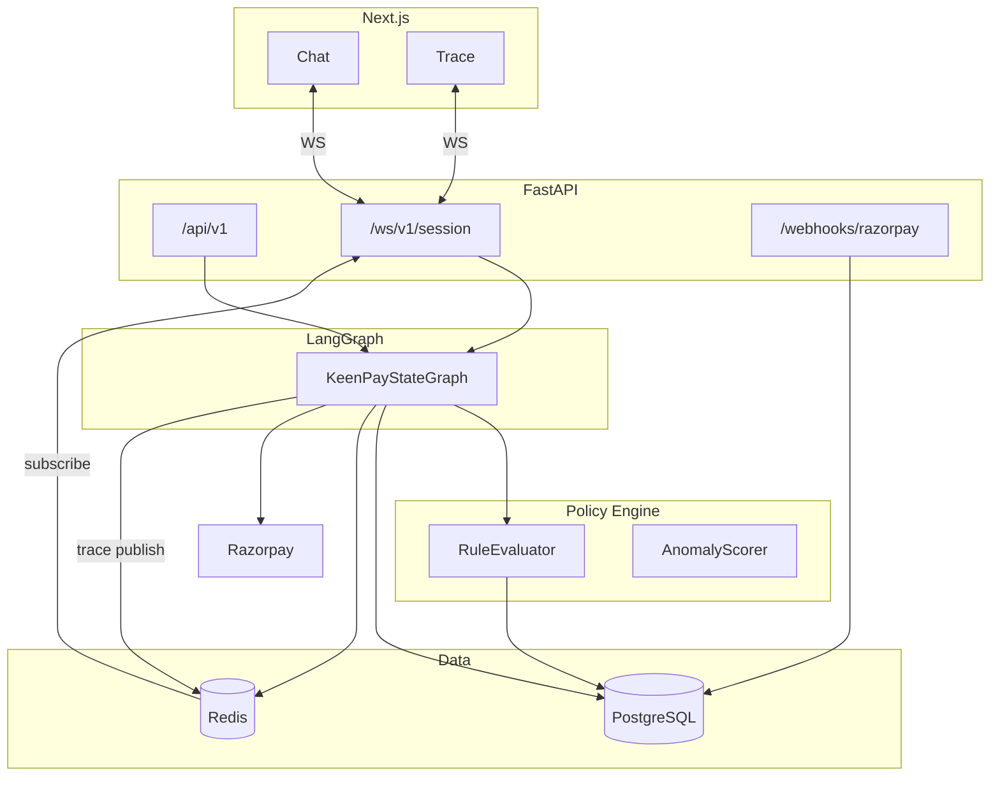
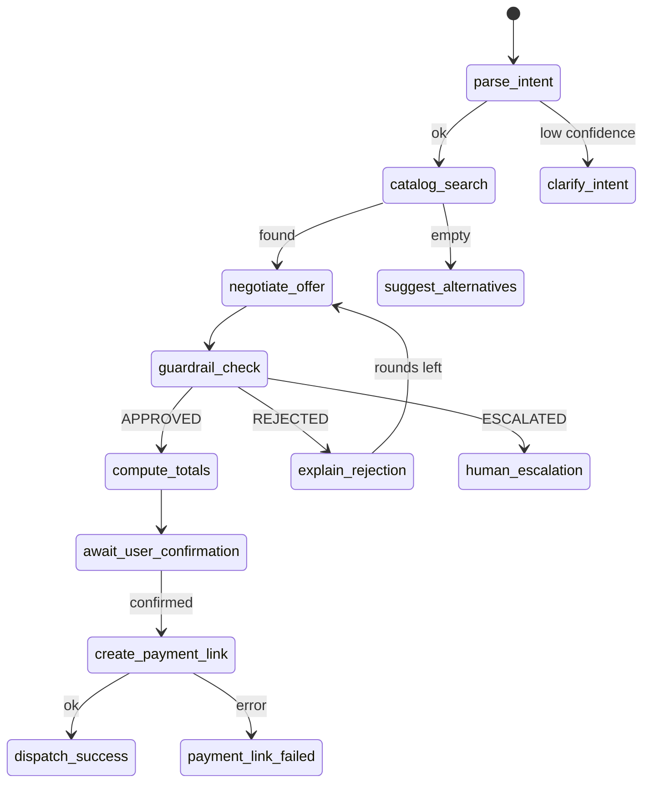

# KeenPay — architecture

FastAPI + LangGraph + PostgreSQL + Redis + Next.js + Razorpay.

This doc is the build map. File paths below are the intended layout once `api/` and `frontend/` exist.

## Planes

| Plane | Role |
|-------|------|
| Presentation | Next.js — chat panel + trace panel, WebSocket client |
| API gateway | FastAPI — REST, WS, Razorpay webhook |
| Orchestration | LangGraph — `KeenPayStateGraph`, checkpoints in Postgres |
| Policy | Sync Python — `PolicyEngine`, no LLM in approve path |
| Data | Postgres source of truth; Redis cache, holds, rate limits, trace pub/sub |



## Intended modules

| Path | Responsibility |
|------|----------------|
| `frontend/` | Split UI, trace renderer |
| `api/main.py` | App entry, CORS, auth |
| `api/graph/keen_checkout.py` | Graph definition |
| `api/graph/state.py` | `KeenPayState` |
| `api/graph/edges.py` | Conditional routing |
| `api/policy/engine.py` | Guardrails |
| `api/policy/anomaly.py` | Injection + score |
| `api/services/catalog.py` | Product search |
| `api/services/razorpay.py` | Links + webhook verify |
| `api/services/audit.py` | `audit_logs` writes |
| `api/services/trace.py` | Redis pub/sub |
| `workers/webhook_processor.py` | Async idempotent webhook handling |

## Request path: chat message

```
1. WS { type: "chat.message", text, session_id }
2. Validate JWT
3. Load/create checkpoint (langgraph_checkpoints / negotiation_sessions)
4. graph.ainvoke(..., config={ thread_id: session_id })
5. Each node -> TraceEvent -> Redis PUBLISH trace:{session_id}
6. WS forwards trace to client
7. chat.response with assistant message + structured offer if any
8. Persist negotiation_sessions + audit_logs on financial steps
```

## Guardrail path (critical)

```
negotiate_offer -> proposed_offer (not trusted)
guardrail_check -> PolicyEngine.evaluate(...)
  -> guardrail_decision, guardrail_decision_id, approved_offer | rejection_reasons
  APPROVED  -> compute_totals -> await_user_confirmation
  REJECTED  -> explain_rejection -> negotiate if rounds < 5
  ESCALATED -> human_escalation -> escalation_tickets
```

Policy evaluation is synchronous. No LLM calls inside `guardrail_check`.

## Payment path

```
await_user_confirmation (interrupt)
  user sends chat.confirm_payment
  create_payment_link:
    assert_payment_gates()
    reserve stock (Redis + PG transaction, inventory_holds)
    POST Razorpay /v1/payment_links (idempotency key)
    INSERT orders (pending)
    audit_logs PAYMENT_LINK_CREATED
```

## Webhook path

```
POST /webhooks/razorpay
  verify X-Razorpay-Signature
  INSERT webhook_events (event_id UNIQUE) — duplicate -> 200 no-op
  match order by payment_link_id
  if amount != order.final_amount_paise -> payment_disputed
  else orders.status = paid, audit_logs PAYMENT_CAPTURED
  WS order.status_updated
```

## State shape (`KeenPayState`)

Defined in `api/graph/state.py`:

```python
class KeenPayState(TypedDict):
    messages: Annotated[list, add_messages]
    session_id: str
    user_id: Optional[str]
    merchant_id: str
    parsed_intent: Optional[dict]
    search_results: list[dict]
    selected_line_items: list[LineItem]
    proposed_offer: Optional[ProposedOffer]
    approved_offer: Optional[ProposedOffer]
    negotiation_round: int  # max 4 (0-indexed) -> 5 rounds
    guardrail_decision: Optional[Literal["APPROVED", "REJECTED", "ESCALATED"]]
    guardrail_decision_id: Optional[str]
    guardrail_detail: Optional[GuardrailDecision]
    rejection_reasons: list[str]
    user_confirmed_payment: bool
    user_confirmed_at: Optional[str]
    final_amount_paise: Optional[int]
    inventory_reserved: bool
    razorpay_payment_link_id: Optional[str]
    razorpay_payment_link_url: Optional[str]
    order_id: Optional[str]
    anomaly_flags: list[str]
    security_block: bool
    error: Optional[dict]
```

`ProposedOffer` / `GuardrailDecision` models are in the same module (see existing ARCHITECTURE excerpt in git history or `state.py` when implemented).

## Graph topology



## Edge helpers (`api/graph/edges.py`)

```python
def after_guardrail(state: KeenPayState) -> str:
    d = state.get("guardrail_decision")
    if d == "APPROVED":
        return "approved"
    if d == "ESCALATED":
        return "escalated"
    return "rejected"

def after_rejection(state: KeenPayState) -> str:
    if state.get("negotiation_round", 0) >= 5:
        return "max_rounds"
    return "retry_negotiate"
```

## Checkpointing

- Checkpointer: `AsyncPostgresSaver` on `langgraph_checkpoints`
- `thread_id` = `negotiation_sessions.id`
- Interrupt before `await_user_confirmation`
- Resume: `Command(resume={"user_confirmed_payment": True})`
- Guardrail decisions bind to `(session_id, offer_version)`

## Trace + audit

**Live (Redis):** `PUBLISH trace:{session_id}`

```python
class TraceEvent(BaseModel):
    event_id: str
    session_id: str
    timestamp: str
    event_type: Literal[
        "graph.node.enter", "graph.node.exit",
        "guardrail.rule.eval", "guardrail.decision",
        "security.flag", "payment.link.created",
        "payment.webhook.received", "error",
    ]
    node_name: Optional[str]
    payload: dict
    duration_ms: Optional[int]
```

**Durable (Postgres):** `audit_logs` — append only, trigger blocks UPDATE/DELETE.

Every money step logs `session_id`, `decision_id`, `offer_version` where applicable.

## Redis keys

| Key | TTL | Use |
|-----|-----|-----|
| `session:{id}:messages` | 24h | hot cache |
| `hold:{session_id}:{sku}` | 15m | soft hold |
| `ratelimit:payment_link:{session_id}` | 1h | max 3 links/hour |
| `ratelimit:chat:{user_id}` | 1m | 30 msg/min |
| `idempotency:rz:link:{session_id}:v{n}` | 24h | cached link response |

## Deploy (pilot)

```
Vercel / static host  -> Next.js
Railway / Fly         -> FastAPI + LangGraph
Managed               -> Postgres 15, Redis 7
External              -> Razorpay, LLM provider
```

Env: `DATABASE_URL`, `REDIS_URL`, `RAZORPAY_*`, `OPENAI_API_KEY`, `MERCHANT_POLICY_JSON`.

## Security notes

- LLM -> `ProposedOffer` only; amounts need guardrail pass
- Webhook: HMAC on raw body; reject stale (>5 min skew)
- WS: JWT in query, validated on connect
- No email/phone in trace payloads

## Failure summary

| Failure | Response |
|---------|----------|
| LLM timeout | 10s cap; no offer change |
| DB down | 503 |
| Guardrail exception | ESCALATED + audit |
| Razorpay 5xx | 3 retries exponential |
| Duplicate webhook | 200 idempotent |

Full matrix: `GUARDRAILS_AND_SAFETY.md`.

## AI boundary

LLM: `parse_intent`, `negotiate_offer` copy.  
Python: everything that touches money.

Do not add `create_payment_link` as an LLM tool. Always call `assert_payment_gates()` before Razorpay.

See `AI_JUDGMENT.md`.
