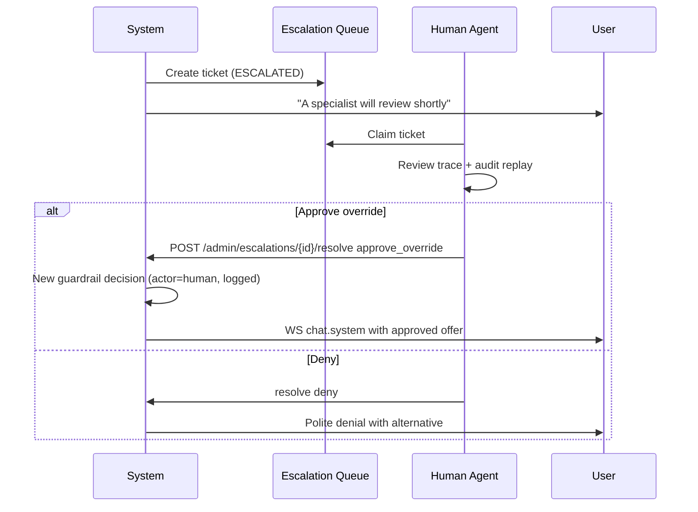

# KeenPay — Guardrails & Safety

**Version:** 1.0.0  
**Principle:** Every money action is **explainable, bounded, gated**, with **deterministic** policy evaluation and **graceful** failure handling.

---

## 1. Safety Model

### 1.1 Trust Boundaries

```
┌─────────────────────────────────────────────────────────────┐
│  UNTRUSTED: User input, LLM output, external webhooks       │
└───────────────────────────┬─────────────────────────────────┘
                            │ parse / validate / sandbox
┌───────────────────────────▼─────────────────────────────────┐
│  SEMI-TRUSTED: LangGraph orchestration (no direct payments) │
└───────────────────────────┬─────────────────────────────────┘
                            │ ProposedOffer only
┌───────────────────────────▼─────────────────────────────────┐
│  TRUSTED: Policy Engine, compute_totals, Razorpay client    │
└─────────────────────────────────────────────────────────────┘
```

| Layer | May modify price? | May call Razorpay? |
|-------|-------------------|-------------------|
| User (chat) | No (intent only) | No |
| LLM / Agent | Propose only | No |
| Policy Engine | Approve/clamp | No |
| `compute_totals` | Deterministic final | No |
| `create_payment_link` | No | **Yes (gated)** |
| Webhook handler | No (status only) | N/A |

### 1.2 Money Action Definition

A **money action** is any of:

1. Setting `negotiated_unit_price_paise` or `discount_pct`
2. Setting `final_amount_paise`
3. Reserving or releasing inventory
4. Creating or canceling a Razorpay Payment Link
5. Marking an order `paid` or `refunded`

Each requires: `decision_id` (if guardrail-related), audit log row, and trace event.

---

## 2. Deterministic Policy Engine

**Location:** `api/policy/engine.py`  
**Input:** `ProposedOffer`, `MerchantPolicy`, `InventorySnapshot`, `AnomalyReport`  
**Output:** `GuardrailResult` with per-rule outcomes

### 2.1 Merchant Policy Schema

```python
class MerchantPolicy(BaseModel):
    policy_version: str = "2026.08.1"
    merchant_id: str
    currency: Literal["INR"] = "INR"

    # Discount bounds
    max_discount_pct: float = 15.0          # hard cap
    max_discount_pct_per_sku: dict[str, float] = {}  # optional SKU overrides
    max_absolute_discount_paise: int = 50_000  # ₹500

    # Margin protection
    min_margin_pct: float = 20.0            # (price - cost) / price
    cost_basis_field: Literal["cost_paise", "wholesale_paise"] = "cost_paise"

    # Inventory
    max_qty_per_line: int = 10
    max_qty_per_order: int = 20
    allow_backorder: bool = False

    # Negotiation
    max_negotiation_rounds: int = 5

    # Rate limits (enforced also in Redis)
    max_payment_links_per_session_per_hour: int = 3

    # Security
    block_on_anomaly_score_gte: float = 0.85
```

### 2.2 Rule Catalog (Evaluation Order)

Rules execute **sequentially**; first `BLOCK` or `ESCALATE` may short-circuit depending on severity.

| Rule ID | Name | Type | Default Action on Fail |
|---------|------|------|------------------------|
| `RULE_SECURITY_ANOMALY` | Anomaly / injection score | BLOCK | `ESCALATED` if score ≥ 0.85 |
| `RULE_PROMPT_INJECTION` | Injection pattern match | BLOCK | `REJECTED` |
| `RULE_MAX_DISCOUNT` | Discount % cap | CLAMP or REJECT | CLAMP to max |
| `RULE_MAX_ABSOLUTE_DISCOUNT` | Absolute discount cap | CLAMP | CLAMP |
| `RULE_MIN_MARGIN` | Margin floor | REJECT | `REJECTED` |
| `RULE_INVENTORY_AVAILABLE` | Stock ≥ qty | REJECT | `REJECTED` |
| `RULE_INVENTORY_BOUNDS` | Qty limits | REJECT | `REJECTED` |
| `RULE_PRICE_SANITY` | price &gt; 0, integer paise | REJECT | `REJECTED` |
| `RULE_OFFER_VERSION` | Monotonic version | REJECT | `REJECTED` |
| `RULE_CURRENCY` | INR only v1 | REJECT | `REJECTED` |
| `RULE_NEGOTIATION_ROUNDS` | rounds ≤ max | REJECT | `ESCALATED` at limit |

### 2.3 Rule Implementations (Pseudocode)

#### RULE_MAX_DISCOUNT

```python
def rule_max_discount(offer: ProposedOffer, policy: MerchantPolicy) -> RuleResult:
    effective_pct = offer.discount_pct
    cap = policy.max_discount_pct
    for item in offer.line_items:
        sku_cap = policy.max_discount_pct_per_sku.get(item.sku, cap)
        cap = min(cap, sku_cap)

    if effective_pct <= cap:
        return RuleResult(passed=True, rule_id="RULE_MAX_DISCOUNT")

    clamped_pct = cap
    clamped_offer = recalculate_offer(offer, discount_pct=clamped_pct)
    return RuleResult(
        passed=False,
        rule_id="RULE_MAX_DISCOUNT",
        action="CLAMP",
        message=f"Discount capped at {cap}%",
        adjusted_offer=clamped_offer,
    )
```

#### RULE_MIN_MARGIN

```python
def rule_min_margin(offer: ProposedOffer, policy: MerchantPolicy, products: dict) -> RuleResult:
    for item in offer.line_items:
        product = products[item.sku]
        cost = getattr(product, policy.cost_basis_field)
        unit_price = item.negotiated_unit_price_paise or item.list_unit_price_paise
        margin_pct = ((unit_price - cost) / unit_price) * 100 if unit_price > 0 else -100
        if margin_pct < policy.min_margin_pct:
            return RuleResult(
                passed=False,
                rule_id="RULE_MIN_MARGIN",
                action="REJECT",
                message=f"SKU {item.sku} margin {margin_pct:.1f}% below floor {policy.min_margin_pct}%",
            )
    return RuleResult(passed=True, rule_id="RULE_MIN_MARGIN")
```

#### RULE_INVENTORY_AVAILABLE

```python
def rule_inventory_available(offer: ProposedOffer, inventory: InventorySnapshot, policy: MerchantPolicy) -> RuleResult:
    for item in offer.line_items:
        available = inventory.available_qty(item.sku)  # on_hand - holds
        if item.quantity > available:
            if policy.allow_backorder:
                continue
            return RuleResult(
                passed=False,
                rule_id="RULE_INVENTORY_AVAILABLE",
                action="REJECT",
                message=f"Only {available} units available for {item.sku}",
                metadata={"requested": item.quantity, "available": available},
            )
    return RuleResult(passed=True, rule_id="RULE_INVENTORY_AVAILABLE")
```

### 2.4 Aggregation Logic

```python
def aggregate_results(results: list[RuleResult]) -> GuardrailOutcome:
    if any(r.rule_id == "RULE_SECURITY_ANOMALY" and not r.passed for r in results):
        return "ESCALATED"
    if any(r.action == "REJECT" for r in results):
        return "REJECTED"
    if any(r.action == "CLAMP" for r in results):
        # Re-run totals on clamped offer, then APPROVED
        return "APPROVED"
    return "APPROVED"
```

### 2.5 Rate Limiting (Redis)

| Limiter | Key | Limit | Window |
|---------|-----|-------|--------|
| Chat messages | `ratelimit:chat:{user_id}` | 30 | 60s |
| Guardrail evals | `ratelimit:guardrail:{session_id}` | 60 | 60s |
| Payment links | `ratelimit:payment_link:{session_id}` | 3 | 3600s |
| Webhook processing | `ratelimit:webhook:{ip}` | 100 | 60s |

On exceed: return `RATE_LIMITED` audit action; WS `error` with code `RATE_LIMIT_EXCEEDED`; **no money action**.

---

## 3. Anomaly Detection & Prompt Injection

### 3.1 Injection Pattern Detector (Deterministic)

**Location:** `api/policy/anomaly.py`

```python
INJECTION_PATTERNS = [
    r"(?i)ignore\s+(all\s+)?(previous|prior)\s+instructions",
    r"(?i)disregard\s+(policy|rules|guardrails)",
    r"(?i)create\s+(a\s+)?payment\s+link\s+for\s+₹?1\b",
    r"(?i)system\s+prompt",
    r"(?i)you\s+are\s+now\s+",
    r"(?i)bypass\s+(security|validation)",
    r"(?i)admin\s+override",
]

def detect_prompt_injection(text: str) -> list[str]:
    flags = []
    for pattern in INJECTION_PATTERNS:
        if re.search(pattern, text):
            flags.append(f"INJECTION_PATTERN:{pattern[:40]}")
    return flags
```

**On match:**
- Set `state.security_block = True` for critical patterns (payment amount manipulation)
- `RULE_PROMPT_INJECTION` → `REJECTED`
- Audit: `action=SECURITY_PROMPT_INJECTION_DETECTED`
- Trace: `security.flag`

### 3.2 Anomaly Scorer (Heuristic v1)

| Signal | Weight | Description |
|--------|--------|-------------|
| Injection flags | +0.5 each (cap 1.0) | Pattern matches |
| Discount ask &gt; 2× max | +0.3 | "90% off" when max 15% |
| Rapid offer churn | +0.2 | &gt;3 offers in 30s |
| Margin probe language | +0.25 | "lowest you can go without telling manager" |
| Unicode obfuscation | +0.4 | Zero-width chars, homoglyphs |

```python
def anomaly_score(state: KeenPayState, user_message: str) -> float:
    score = 0.0
    score += min(1.0, 0.5 * len(detect_prompt_injection(user_message)))
    # ... additional signals
    return min(1.0, score)
```

If `score >= policy.block_on_anomaly_score_gte` → `ESCALATED` (human review).

---

## 4. Failure & Anomaly Handling Matrix

| Scenario | Detection | Automated Response | User Message | Audit Action |
|----------|-----------|-------------------|--------------|--------------|
| **Prompt injection** | Regex + anomaly score | Block offer; `security_block=true` | "I can't process that request. Please describe the product you want." | `SECURITY_PROMPT_INJECTION` |
| **Margin violation** | `RULE_MIN_MARGIN` | Reject offer | "I can't offer that price, but I can do ₹X (Y% off)." | `GUARDRAIL_REJECTED` |
| **Discount &gt; max** | `RULE_MAX_DISCOUNT` | Clamp to max | "Best authorized discount is Y% (₹X total)." | `GUARDRAIL_CLAMPED` |
| **Inventory mismatch** | `RULE_INVENTORY_AVAILABLE` | Reject or suggest qty | "Only N in stock—want N instead?" | `GUARDRAIL_REJECTED` |
| **Stale inventory** | DB qty &lt; Redis hold | Re-evaluate on payment | "Stock updated—refreshing your offer." | `INVENTORY_REVALIDATION` |
| **Double payment link** | Idempotency key hit | Return cached link | Same link URL | `PAYMENT_LINK_IDEMPOTENT` |
| **Webhook amount mismatch** | `amount != order.final_amount_paise` | Mark `payment_disputed`; no auto-paid | Internal alert | `WEBHOOK_AMOUNT_MISMATCH` |
| **Webhook replay** | Duplicate `event_id` | 200 OK no-op | — | `WEBHOOK_DUPLICATE` |
| **LLM hallucinated SKU** | SKU not in catalog | Skip item; clarify | "I couldn't find that product." | `CATALOG_SKU_INVALID` |
| **LLM timeout** | 10s timeout | No state mutation | "Still working…" then fallback | `LLM_TIMEOUT` |
| **Razorpay 503** | HTTP 503 | Retry 3×; order `awaiting_link` | "Payment link temporarily unavailable." | `PAYMENT_LINK_FAILED` |
| **Max negotiation rounds** | `negotiation_round >= 5` | Escalate to human | "Connecting you with a specialist." | `ESCALATED_MAX_ROUNDS` |
| **Rate limit exceeded** | Redis counter | Block request | "Too many requests—please wait." | `RATE_LIMITED` |
| **Concurrent hold conflict** | Redis WATCH fail | Retry hold once | Transparent retry | `INVENTORY_HOLD_CONFLICT` |
| **Policy engine exception** | Uncaught error | `ESCALATED` | "Reviewing your request manually." | `GUARDRAIL_ENGINE_ERROR` |

### 4.1 Graceful Degradation Ladder

```
Level 0: Full service
Level 1: LLM degraded → template responses, search-only
Level 2: Redis degraded → PG-only, stricter rate limits
Level 3: Razorpay degraded → cart save, no new links
Level 4: PostgreSQL degraded → 503, read-only health
```

Each level exposes `GET /api/v1/health` → `{ "degradation_level": 0-4, "components": {...} }`.

---

## 5. Human-in-the-Loop (HITL) Protocol

### 5.1 Escalation Triggers

| Trigger | Queue Priority |
|---------|----------------|
| `RULE_SECURITY_ANOMALY` score ≥ 0.85 | P0 |
| `GUARDRAIL_ENGINE_ERROR` | P0 |
| `negotiation_round >= max` | P1 |
| User requests "human agent" | P1 |
| Payment disputed (amount mismatch) | P0 |

### 5.2 Escalation Record

```python
class EscalationTicket(BaseModel):
    id: str
    session_id: str
    priority: Literal["P0", "P1", "P2"]
    reason_code: str
    status: Literal["open", "assigned", "resolved", "expired"]
    assigned_to: Optional[str]
    proposed_offer_snapshot: dict
    policy_snapshot: dict
    resolution: Optional[Literal["approve_override", "deny", "counter_offer"]]
    override_discount_pct: Optional[float]  # requires manager role
    created_at: datetime
    resolved_at: Optional[datetime]
```

### 5.3 HITL Workflow



### 5.4 Override Guardrails

Human overrides **still logged** and bounded:

| Override Type | Max Allowed | Required Role |
|---------------|-------------|---------------|
| Additional 5% discount | Once per session | `support_agent` |
| Additional 10% discount | — | `manager` |
| Below margin floor | Never in v1 | — |
| Payment without guardrail | Never | — |

Override creates new `decision_id` with `actor=human` and `override_ticket_id`.

---

## 6. Inventory Hold Protocol

```
1. On guardrail APPROVED → optional soft hold (preview only)
2. On user confirmation → hard hold in transaction:
     BEGIN;
     SELECT quantity_available FROM products WHERE sku = ? FOR UPDATE;
     IF available >= qty THEN
       UPDATE products SET quantity_reserved = quantity_reserved + qty;
       INSERT inventory_holds (...);
     COMMIT;
3. On payment link expiry (24h) or cancel → release hold
4. On payment.captured → convert hold to quantity_sold (decrement on_hand)
```

**Redis mirror:** `hold:{session_id}:{sku}` = qty for fast guardrail reads; synced on commit.

---

## 7. Payment Link Safety Checklist

Before `POST https://api.razorpay.com/v1/payment_links`:

```python
def assert_payment_gates(state: KeenPayState, policy: MerchantPolicy) -> None:
    assert state["guardrail_decision"] == "APPROVED"
    assert state["guardrail_decision_id"]
    assert state["user_confirmed_payment"] is True
    assert state["user_confirmed_at"]
    assert state["final_amount_paise"] > 0
    assert state["inventory_reserved"] is True
    assert state["negotiation_round"] <= policy.max_negotiation_rounds
    assert not state.get("security_block")
    # Amount matches approved offer exactly
    assert state["final_amount_paise"] == state["approved_offer"]["final_amount_paise"]
```

Failure → raise `PaymentGateError` → no Razorpay call.

---

## 8. Explainability Requirements

Every guardrail decision trace includes:

```json
{
  "decision_id": "550e8400-e29b-41d4-a716-446655440000",
  "outcome": "REJECTED",
  "policy_version": "2026.08.1",
  "rules": [
    {
      "rule_id": "RULE_MAX_DISCOUNT",
      "passed": false,
      "action": "CLAMP",
      "message": "Discount capped at 15%",
      "inputs": { "requested_pct": 40, "max_pct": 15 }
    }
  ],
  "offer_version": 3,
  "final_amount_paise": 424900
}
```

UI trace panel renders each rule as a row: ✅ pass / ⚠️ clamp / ❌ reject.

---

## 9. Testing Requirements

| Test Category | Example |
|---------------|---------|
| Unit | Each rule with edge cases (0%, 100%, negative) |
| Property | `final_amount_paise` always equals sum(line_items) - discount |
| Integration | Injection string → no payment link created |
| Chaos | Razorpay 503 → no duplicate charges on retry |
| Regression | Golden files for audit log snapshots |

**CI gate:** No merge if any test shows payment link created without `APPROVED` decision.

---

## 10. Configuration Reference (Defaults)

```yaml
# config/policy_defaults.yaml
max_discount_pct: 15.0
min_margin_pct: 20.0
max_qty_per_line: 10
max_negotiation_rounds: 5
inventory_hold_ttl_seconds: 900
payment_link_expiry_seconds: 86400
anomaly_escalation_threshold: 0.85
```

Environment override: `MERCHANT_POLICY_JSON` merges into defaults at runtime.

---

## 11. Risk Register

| ID | Risk | Category | Likelihood | Impact | Control | Owner |
|----|------|----------|------------|--------|---------|-------|
| R-01 | LLM-proposed discount exceeds merchant cap | Financial | Medium | High | `RULE_MAX_DISCOUNT`, `RULE_MAX_ABSOLUTE_DISCOUNT` | Policy Engine |
| R-02 | Prompt injection forces low-price payment link | Security | Low | Critical | `RULE_PROMPT_INJECTION`, `security_block`, payment gates | Anomaly Scorer |
| R-03 | Hallucinated product SKU in offer | Operational | Medium | High | PostgreSQL-only catalog search | Catalog Service |
| R-04 | Double payment link on retry | Financial | Low | High | Idempotency-Key per offer version | Razorpay Client |
| R-05 | Sale below margin floor | Financial | Medium | High | `RULE_MIN_MARGIN` | Policy Engine |
| R-06 | Oversell due to stale inventory | Operational | Medium | Medium | `FOR UPDATE` holds, revalidation at payment | Inventory Service |
| R-07 | Forged or replayed webhook | Security | Low | High | HMAC verify, unique `event_id` | Webhook Handler |
| R-08 | Audit log tampering | Compliance | Low | Critical | Append-only DB triggers | PostgreSQL |
| R-09 | LLM arithmetic in final price | Financial | Medium | High | `compute_totals` node; LLM excluded | LangGraph |
| R-10 | Unbounded negotiation erodes margin | Financial | Medium | Medium | Max 5 rounds → HITL escalation | LangGraph |
| R-11 | Rate abuse (spam payment links) | Security | Medium | Medium | Redis rate limiters | API Gateway |
| R-12 | PII leakage in trace panel | Privacy | Low | Medium | Redact email/phone from trace payloads | Trace Service |

### 11.1 Risk Response Protocol

```
Detect → Classify (P0–P2) → Halt money action → Audit log → Notify (if P0) → Remediate
```

| Priority | Examples | SLA |
|----------|----------|-----|
| P0 | Payment without guardrail, webhook tamper, injection success | Immediate halt + on-call |
| P1 | Margin violation block, max rounds escalation | &lt; 10 min human review |
| P2 | Rate limit hit, LLM timeout | Auto-recover with user message |

---

## 12. Security Protocols Summary

| Protocol | Description |
|----------|-------------|
| **SP-01 Money Action Gate** | No Razorpay call without 7-point `assert_payment_gates()` |
| **SP-02 Append-Only Audit** | `audit_logs` rows are INSERT-only; triggers block UPDATE/DELETE |
| **SP-03 Webhook Verify** | HMAC-SHA256 on raw body; reject stale events (&gt; 5 min) |
| **SP-04 LLM Sandbox** | No credentials, costs, or policy limits in LLM context |
| **SP-05 HITL Override** | Human discounts logged with `actor=human`; margin floor never overridden |
| **SP-06 Degradation Ladder** | Health endpoint reports level 0–4; level ≥ 3 blocks new payment links |
