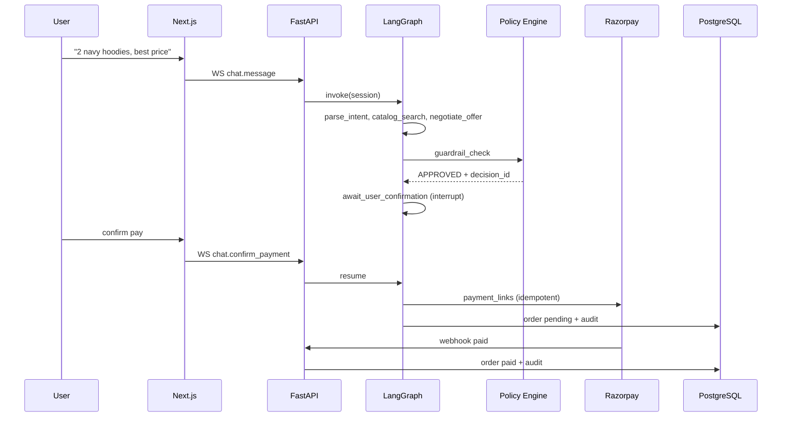

# KeenPay — product requirements

Last updated: Aug 2026. Status: spec complete, implementation in progress.

## Summary

KeenPay lets a buyer complete a purchase through conversation while the merchant keeps control of discounts, margin, and payment. LangGraph runs the chat flow. A Python policy engine approves or rejects every offer before Razorpay sees it. The UI is split: chat left, live trace right.

Goal: AI-assisted buyer checkout end-to-end — intent to paid order — with a defensible audit trail.

## Problem

Merchants want conversational selling but cannot let a model set prices or trigger charges. Finance needs to know *why* a discount happened. Buyers need to see the same guardrail decisions the ops team sees.

KeenPay sits in the middle: grow revenue in chat, sell through Razorpay test/live APIs, protect margin with deterministic gates.

## Principles (non-negotiable)

1. **Gate money** — no `POST /v1/payment_links` without `APPROVED` guardrail + explicit user confirm
2. **LLM for language, Python for truth** — see `AI_JUDGMENT.md`
3. **Audit everything financial** — `decision_id`, inputs, rule outcomes, actor in `audit_logs`
4. **Fail safe** — injection, timeout, margin breach: halt money, escalate when needed
5. **Show the work** — trace viewer streams node + rule events over WebSocket

## Users

**Shopper** — negotiates, wants clear reasons when a discount is denied.  
**Merchant ops** — sets caps and margin floor; replays orders from audit.  
**Support (HITL)** — resolves escalations with full session + trace; overrides are logged.

## Core flow



### Steps

| # | Who | What | Gate |
|---|-----|------|------|
| 1 | User | States intent | — |
| 2 | Agent | `parse_intent` | low confidence -> clarify |
| 3 | Agent | `catalog_search` (Postgres) | empty -> alternatives |
| 4 | Agent | `negotiate_offer` (propose % only) | not final price |
| 5 | Policy | `guardrail_check` | **must be APPROVED** |
| 6 | Python | `compute_totals` | integer paise |
| 7 | User | Confirm payment | **user_confirmed_at** |
| 8 | System | Razorpay Payment Link | idempotency per offer version |
| 9 | Razorpay | Webhook | HMAC + amount match |

Negotiation loop: max 5 rounds, then `ESCALATED` -> human queue.

### Payment gates (all required)

```python
gates = [
    state.guardrail_decision == "APPROVED",
    state.guardrail_decision_id is not None,
    state.user_confirmed_payment is True,
    state.final_amount_paise == state.approved_offer.final_amount_paise,
    state.inventory_reserved is True,
    state.security_block is False,
    rate_limiter.allow("payment_link", session_id),
]
```

## Failure cases we must handle

| Case | Behavior |
|------|----------|
| Prompt injection | `security_block`, no link |
| Margin violation | reject, explain limit |
| Discount over cap | clamp or reject, trace rule |
| LLM timeout (10s) | no offer mutation |
| Razorpay 503 | backoff retry, order stays pending |
| Webhook amount mismatch | `payment_disputed`, no auto-paid |
| Max negotiation rounds | HITL ticket |

Details: `GUARDRAILS_AND_SAFETY.md`.

## Functional requirements

### Conversation (P0 unless noted)

- FR-01 Parse intent: product, qty, attributes, budget
- FR-02 Catalog full-text search with live stock
- FR-03 Product cards in chat (SKU, price, available qty)
- FR-04 Session history in Redis, 24h TTL (P1)

### Negotiation (P0)

- FR-10 Agent proposes; policy authorizes
- FR-11 Rejections cite policy in user copy
- FR-12 Max 5 rounds
- FR-13 Integer paise, INR only in v1

### Guardrails & payments (P0)

- FR-20 Deterministic policy on every offer
- FR-21 Link amount == `final_amount_paise`
- FR-22 Idempotent link per `(session_id, offer_version)`
- FR-23 Webhook HMAC-SHA256
- FR-24 Inventory hold on confirm, 15 min TTL (P1)
- FR-25 Razorpay test mode for staging

### Observability (P0)

- FR-30 Stream graph node events on WebSocket
- FR-31 Stream per-rule guardrail evals
- FR-32 Append-only `audit_logs` for money actions
- FR-33 Session replay for support (P1)

## Non-functional targets

- API uptime 99.5% (pilot)
- P95 guardrail < 50ms; full turn < 3s
- No secrets in LLM context; hosted Razorpay checkout
- Audit retention 90 days
- 100 concurrent WS sessions v1

## Risks (short)

| ID | Risk | Mitigation |
|----|------|------------|
| R-01 | Discount over cap | `RULE_MAX_DISCOUNT` |
| R-02 | Injection -> cheap link | injection rules + payment gates |
| R-03 | Hallucinated SKU | Postgres-only catalog |
| R-04 | Double charge | idempotency keys |
| R-05 | Below margin | `RULE_MIN_MARGIN` |
| R-06 | Oversell | `FOR UPDATE` holds |
| R-07 | Bad webhook | HMAC + unique `event_id` |
| R-08 | Audit tamper | append-only trigger |

Full register in `GUARDRAILS_AND_SAFETY.md`.

## v1 scope

- Single merchant (`merchant_keen`), ~50 SKUs, INR
- Razorpay Payment Links (test + prod keys)
- Split UI + trace panel
- 11 policy rules + `escalation_tickets`
- Derived transaction passport from audit tables

## v1.1 (later)

- Multi-merchant + RLS
- Coupon stacking
- SMS/email link delivery

## Glossary

- **Money action** — discount, final amount, inventory hold/release, payment link, mark paid
- **Gated side effect** — external API only after deterministic approval
- **Offer version** — increments each `negotiate_offer`; bound to guardrail `decision_id`

## Related docs

`ARCHITECTURE.md`, `GUARDRAILS_AND_SAFETY.md`, `AI_JUDGMENT.md`, `API_SPEC.md`, `SCHEMA.sql`, `DEVELOPMENT_LOG.md`
