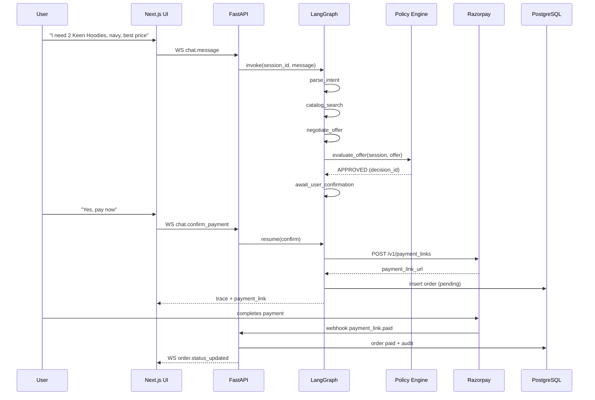

# KeenPay — Product Requirements Document

**Product:** KeenPay  
**Version:** 1.0.0  
**Status:** Implementation-ready  
**Last updated:** 2026-08-29

---

## 1. Executive Summary

KeenPay is a **secure agentic commerce platform** that helps merchants grow revenue through conversational checkout while keeping every monetary action **explainable, bounded, gated, and auditable**.

Shoppers negotiate purchases in natural language. A LangGraph agent handles intent recognition, catalog routing, and negotiation copy. A **deterministic policy engine** (never the LLM) authorizes discounts, inventory holds, and Razorpay Payment Link creation. The frontend is a **split UI**: chat on the left, live agent state and guardrail trace on the right.

**Mission:** Make a merchant transactable by an AI-assisted buyer end-to-end — from product intent to paid order — without sacrificing financial safety.

---

## 2. Problem Statement

### 2.1 Merchant Pain

| Pain | Business impact |
|------|-----------------|
| Checkout abandonment | Lost revenue from filter-heavy, form-heavy flows |
| Uncontrolled discounting | Margin erosion from ad-hoc chat or support deals |
| AI commerce without audit | Finance cannot defend LLM-originated prices |
| Payment trust deficit | Buyers hesitate when AI initiates charges invisibly |

### 2.2 KeenPay Solution

1. User states purchase intent in natural language.
2. Agent searches catalog and negotiates within merchant policy.
3. Every price change passes deterministic guardrails (max discount %, margin floor, inventory, transaction caps).
4. Payment link creation is a **gated side effect** requiring policy approval + explicit user confirmation.
5. All state transitions stream to the trace panel and persist in append-only `audit_logs`.

---

## 3. Design Principles

| Principle | Implementation |
|-----------|----------------|
| **Gate every money action** | No Razorpay call without `guardrail_decision == APPROVED` + user confirmation |
| **LLM for language, Python for truth** | LLM: intent, negotiation copy. Python: math, inventory, policy, payments |
| **Explicit audit trail** | Every financial step logged with `decision_id`, inputs, rule outcomes, actor |
| **Graceful failure** | Prompt injection, API timeout, margin violation → halt money action, escalate if needed |
| **Observable by default** | Trace viewer shows node transitions and per-rule guardrail evaluations |

See `AI_JUDGMENT.md` for the full responsibility matrix.

---

## 4. User Personas

### 4.1 Priya — Shopper

- Compares prices, asks for bundle deals
- Needs transparent pricing and visible reasons when discounts are denied
- Success: completes purchase with confidence in price fairness

### 4.2 Arjun — Merchant Ops Manager

- Configures margin floors, max discount %, inventory alerts
- Needs zero policy bypasses and full audit replay per order
- Success: revenue grows without margin violations

### 4.3 Meera — Support Agent (Human-in-the-Loop)

- Handles escalations when guardrails block or anomaly scores spike
- Needs session replay, proposed vs. allowed price, logged override actions
- Success: resolves escalations with complete audit trail

---

## 5. Core Flow

**Intent → Catalog Search → Negotiation → Guardrail Check → Payment Link Dispatch**



### 5.1 Step Reference

| Step | Actor | Action | Gate |
|------|-------|--------|------|
| 1 | User | States purchase intent | — |
| 2 | Agent | `parse_intent` extracts product, qty, attributes, budget | confidence &lt; 0.6 → clarify |
| 3 | Agent | `catalog_search` queries PostgreSQL + Redis cache | empty → suggest alternatives |
| 4 | Agent | `negotiate_offer` proposes discount (not final price) | LLM cannot authorize alone |
| 5 | Policy Engine | `guardrail_check` runs deterministic rules | **HARD GATE: APPROVED** |
| 6 | Python | `compute_totals` calculates `final_amount_paise` | no LLM arithmetic |
| 7 | User | Explicit confirmation | **HARD GATE: user_confirmed_at** |
| 8 | System | Create Razorpay Payment Link (test or live mode) | idempotency key per offer version |
| 9 | Razorpay | Webhook `payment_link.paid` | HMAC verify + amount match |

### 5.2 Negotiation Loop (Bounded)

```
User message → negotiate_offer → guardrail_check
                    ↑                    |
                    |         REJECTED → explain + counter within bounds
                    └────────────────────┘ (max 5 rounds → ESCALATED)
```

### 5.3 Payment Link Gates

All must pass before `POST /v1/payment_links`:

```python
gates = [
    state.guardrail_decision == "APPROVED",
    state.guardrail_decision_id is not None,
    state.user_confirmed_payment is True,
    state.final_amount_paise == approved_offer.final_amount_paise,
    state.inventory_reserved is True,
    state.security_block is False,
    rate_limiter.allow("payment_link", session_id),
]
```

---

## 6. Failure Recovery Requirements

KeenPay must safely handle these scenarios without executing unauthorized money actions:

| Scenario | Required behavior |
|----------|-------------------|
| Prompt injection | Block; `security_block=true`; no payment link |
| Margin violation | Reject offer; explain policy limit to user |
| Discount above cap | Clamp or reject; trace shows `RULE_MAX_DISCOUNT` |
| LLM timeout (10s) | Template fallback; no offer mutation |
| Razorpay API 503 | Retry with backoff; order stays `awaiting_payment_link` |
| Webhook amount mismatch | Mark `payment_disputed`; alert ops; no auto-approve |
| Max negotiation rounds | Escalate to human-in-the-loop queue |

Full matrix: `GUARDRAILS_AND_SAFETY.md`.

---

## 7. Functional Requirements

### 7.1 Conversation & Catalog

| ID | Requirement | Priority |
|----|-------------|----------|
| FR-01 | Parse intent: product, attributes, quantity, budget | P0 |
| FR-02 | Full-text catalog search with live stock | P0 |
| FR-03 | Product cards in chat (SKU, price, stock) | P0 |
| FR-04 | Session history (Redis, 24h TTL) | P1 |

### 7.2 Negotiation

| ID | Requirement | Priority |
|----|-------------|----------|
| FR-10 | Agent proposes discounts; policy engine authorizes | P0 |
| FR-11 | Rejections cite policy limit in user-facing copy | P0 |
| FR-12 | Max 5 negotiation rounds per session | P0 |
| FR-13 | All amounts in integer paise (INR) | P0 |

### 7.3 Guardrails & Payments

| ID | Requirement | Priority |
|----|-------------|----------|
| FR-20 | Deterministic policy engine on every offer | P0 |
| FR-21 | Payment link amount == approved `final_amount_paise` | P0 |
| FR-22 | Idempotent payment link per `(session_id, offer_version)` | P0 |
| FR-23 | Webhook HMAC-SHA256 verification | P0 |
| FR-24 | Inventory hold on confirmation (15 min TTL) | P1 |
| FR-25 | Razorpay test-mode support for staging | P0 |

### 7.4 Observability

| ID | Requirement | Priority |
|----|-------------|----------|
| FR-30 | Stream LangGraph node events via WebSocket | P0 |
| FR-31 | Stream per-rule guardrail evaluations | P0 |
| FR-32 | Append-only `audit_logs` for all money actions | P0 |
| FR-33 | Session replay for support (read-only) | P1 |

---

## 8. Non-Functional Requirements

| Category | Target |
|----------|--------|
| Availability | 99.5% API uptime |
| Latency | P95 guardrail &lt; 50ms; full turn &lt; 3s |
| Security | No secrets in LLM context; PCI minimized via Razorpay hosted checkout |
| Audit retention | 90 days minimum |
| Concurrency | 100 concurrent WebSocket sessions (v1) |

---

## 9. Risk Overview

| Risk ID | Risk | Likelihood | Impact | Mitigation |
|---------|------|------------|--------|------------|
| R-01 | LLM bypasses discount cap | Medium | High | Deterministic `RULE_MAX_DISCOUNT`; no LLM payment tools |
| R-02 | Prompt injection creates ₹1 link | Low | Critical | `RULE_PROMPT_INJECTION` + payment gates |
| R-03 | Hallucinated SKU shipped | Medium | High | Catalog search via PostgreSQL only |
| R-04 | Double charge on retry | Low | High | Idempotency keys on links + webhooks |
| R-05 | Margin erosion at scale | Medium | High | `RULE_MIN_MARGIN` on every offer |
| R-06 | Stale inventory oversell | Medium | Medium | `FOR UPDATE` holds + revalidation at payment |
| R-07 | Webhook replay / tamper | Low | High | HMAC verify + unique `event_id` |
| R-08 | Audit log tampering | Low | Critical | Append-only DB triggers |

Full register: `GUARDRAILS_AND_SAFETY.md` §11.

---

## 10. Success Metrics

| Metric | Target (30-day pilot) |
|--------|----------------------|
| Session → paid conversion | ≥ 25% |
| Unauthorized discount leaks | 0 |
| Mean time to payment link (approved) | &lt; 2s |
| Audit completeness | 100% money actions have `decision_id` |
| Escalation resolution time | &lt; 10 min median |

---

## 11. Release Scope

### v1.0 (MVP)

- Single merchant, 50 SKUs, INR only
- Razorpay Payment Links (test + production modes)
- Split UI with live trace viewer
- 11 guardrail rules + human escalation queue
- Append-only audit trail

### v1.1

- Multi-merchant onboarding
- Coupon stacking rules
- SMS/email payment link delivery

---

## 12. Glossary

| Term | Definition |
|------|------------|
| **Money action** | Any change to charge amount, discount, inventory hold, or payment link |
| **Gated side effect** | External API call allowed only after deterministic approval |
| **parse_intent** | First graph node: converts natural language to structured `parsed_intent` |
| **Trace event** | Real-time payload for node or rule evaluation in the UI |
| **Offer version** | Monotonic integer per `negotiate_offer` output |

---

## 13. Related Documents

| Document | Purpose |
|----------|---------|
| `ARCHITECTURE.md` | System design, LangGraph graph, data flow |
| `GUARDRAILS_AND_SAFETY.md` | Policies, protocols, failure matrix, risk register |
| `AI_JUDGMENT.md` | LLM vs. Python responsibility split |
| `API_SPEC.md` | REST, WebSocket, Razorpay contracts |
| `SCHEMA.sql` | PostgreSQL DDL |
| `DEVELOPMENT_LOG.md` | Engineering incident and resolution log |
